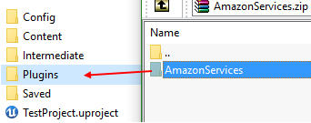
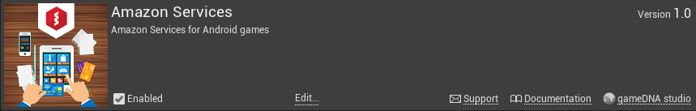

# Amazon Services

The **Amazon Services** plugin lets you integrate out-of-the-box [Amazon Services](https://developer.amazon.com/public/apis/earn/in-app-purchasing) into your [Unreal Engine 4](http://www.unrealengine.com) project (compatible with Android).

* **Current version:** 1.2
* **Binaries compiled for:** Unreal Engine 4.11.0
* **Required Unreal Engine 4.11 or above.**

## Features
* In-App Purchases
* Implements Online Subsystem
* Works with dev & shipping builds
* Out-of-the-box for Android
* No additional libraries are needed
* Native features
* Works with Blueprint-only & source code projects
* Works with Launcher & GitHub UE4 versions

## Setup
Copy this folder to the *Plugins* folder located in the main path of your project.

Enable *Amazon Services* in *Edit -> Plugins -> Networking -> Amazon Services*.

Edit *DefaultEngine.ini* config file and add following line to *[/Script/AndroidRuntimeSettings.AndroidRuntimeSettings]* section:
> bEnableAmazonSupport=True

That's all! *Amazon Services* Online Subsystem works now! :)

Plugin icon designed by _Freepik_.
